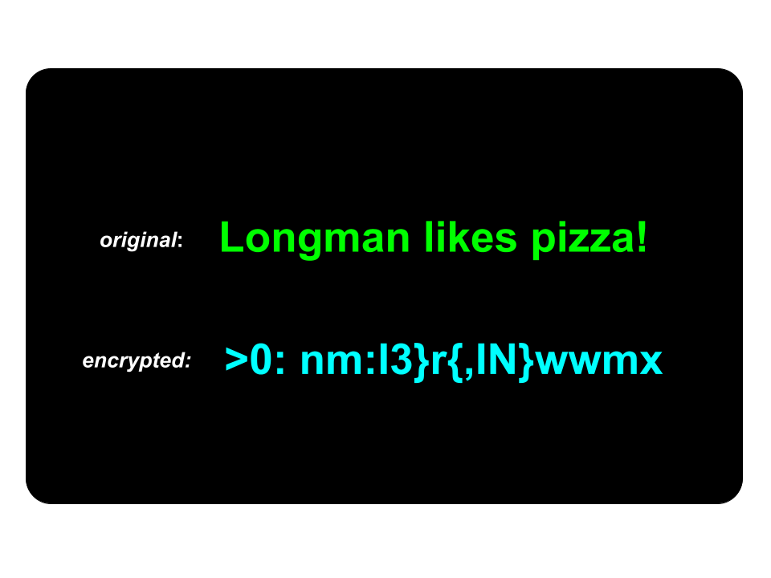

<div style="text-align: center; margin-bottom: 10px;">
  
</div>

# Substitution Cipher Encryption Program

This Python program implements a simple **substitution cipher** to encrypt and decrypt text messages.  
It works by mapping each character in a predefined character set to a randomly shuffled version of itself.

---

## Features
- **Encryption**: Converts a plaintext message into an encrypted message using a randomized key mapping.
- **Decryption**: Converts an encrypted message back into the original plaintext using the same key mapping.
- **Custom Character Set**: Supports spaces, letters (uppercase and lowercase), digits, and punctuation.

---

## How It Works
1. The program creates a list of all allowed characters:
   - Space (`" "`)
   - ASCII letters (`a-z`, `A-Z`)
   - Digits (`0-9`)
   - All punctuation characters
2. A copy of the character list is **shuffled** to create a key mapping.
3. **Encryption**:  
   - For each character in the plaintext, the program finds its index in the original list and replaces it with the character at the same index in the shuffled list.
4. **Decryption**:  
   - For each character in the ciphertext, the program finds its index in the shuffled list and replaces it with the character at the same index in the original list.

---

## Limitations
- Encryption and decryption must be performed in the **same session**, since the shuffled key changes each time you run the program.
- Without the exact key used for encryption, it is impossible to decrypt the message.
- Characters outside the predefined set may not be processed correctly.
- This cipher is **not suitable for secure communications** — it is intended for educational or demonstration purposes only.

---

## Installation & Setup

To download and run this project locally:

```bash
# Clone the repository
git clone https://github.com/Longman-max/substitution-cipher-program.git

# Navigate into the project folder
cd substitution-cipher-program

# (Optional but recommended) Create a virtual environment
python -m venv venv

# Activate the virtual environment
# On Windows:
venv\Scripts\activate
# On macOS/Linux:
source venv/bin/activate

# run the program 
py main.py